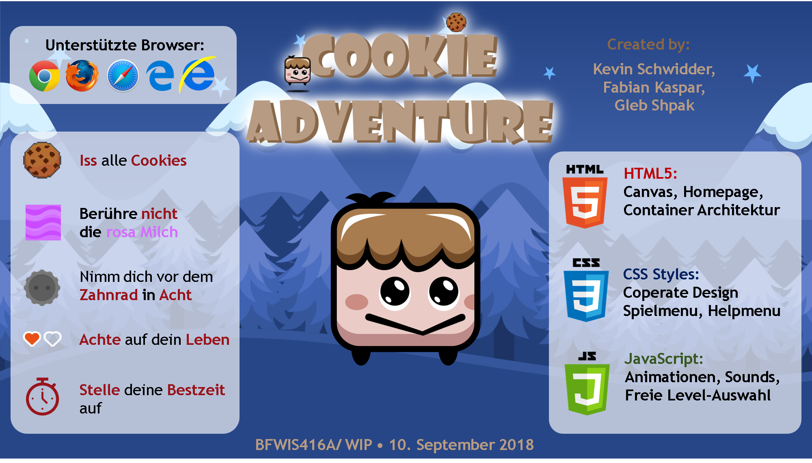

# Cookie Adventure

Cookie Adventure ist ein Adventure Spiel, welches im Rahmen der Vorlesung "Projekte der Wirtschaftsinformatik" (Q3/2018) 
an der FHDW in Bergisch Gladbach entwickelt wurde.

Das ganze Spiel basiert auf unterschiedlichen Leveln, die der Spieler erfolgreich meisten muss.
Ein Level zählt dann als geschafft, wenn alle Cookies aufgesammelt worden sind:
Wenn der Spieler die lila Milch berührt wird das Level zurückgesetzt und er muss wieder 
von seiner Startposition (Spawn) anfangen.

Wir haben uns für ein einfaches und schlichtes Level design in Form eines Arrays entschieden, 
sodass es für jeden einfach zu lesen und zu editieren ist.

## Release-Informationen
**Release**: Cookie Adventure 1.0
* Spieler (Rechteck), Bewegung des Spielers, Springen,
* Plattformen (Rechtecke) hart reingezeichnet

**Release**: Cookie Adventure 1.5
* Collisions:
    * Player, Lava, Coin
* Map:
    * Map in Canvas einlesen
    * Map Elemente: Spawn ,Coins, Lava
* Funktionalitäten: 
    * Coin einsammeln, Coin Counter, Lava = Game Over pushup

**Release**: Cookie Adventure 2.0
* Corporate Design: Player, Enemy, Cookie:
    * Animationen, Soundeffekte hinzugefügt
    * Neuer Name, neues Logo, neue Bilder und Pitchslide hinzugefügt
    * Anpassung der Homepage, Schrift, Farbe, Icons...

* Game: neue Gegner, Viewpoint, Game Menu, Level überspringen & auswählen
    * Viewpoint auf den Spieler, der Spieler wird vom Canvas verfolgt
    * Game Menu mit Pausieren, Musik Einstellungen, Level überspringen hinzugefügt
    * Homepage überarbeitet, Spielanleitung hinzugefügt, Datenschutz und Impressum und Über das Spiel überarbeitet
    * Neue Gegner: Zahnrad, langsam fallende Milch, Schnell fallende Milch
    * Neue Funktionalitäten: Musik Buttons überarbeitet, Level auswählen hinzugefügt, Zeit pro Level hinzugefügt

### Browserkompatibilität
Die folgenden Browser werden vollständig unterstützt:
* Google Chrome (Microsoft Windows, Apple macOS, Linux)
* Mozilla Firefox (Microsoft Windows, Apple macOS, Linux)
* Microsoft Edge
* Apple Safari (Apple macOS)

Die folgenden Browser werden teilweise unterstützt:
* Microsoft Internet Explorer (keine Soundeffects)

### Bekannte Fehler (Bugs)
* Im Microsoft Internet Explorer funktionieren die Soundeffects nicht.
* Wenn mehrere Cookies gleichzeitig eingesammelt wird der Sound nur einmal abgespielt, da wir keine Soundüberlappung erlauben wollten.
* In Chrome funktioniert die Hintergrundmusik nicht beim Aufrufen der Webseite (Schutzmechanismus von Chrome)

## Projekt Details
Dieses Projekt setzt auf vanilla HTML, CSS und JavaScript auf.
Die Einbindung von Libraries ist generell nicht vorgesehen.

Um das Projekt lokal aufsetzen, sind die folgenden Schritte erforderlich:

1. Repository klonen: `git clone https://github.com/Schwidder/team_adventure.git`
2. Im beliebigen Browser die `index.html` öffnen

## Architektur
### Verzeichnisse und Dateien
Zu den relevanten Verzeichnissen und Dateien zählen:
* `assets/`: Alle verwendeten Bilder
* `content/`: HTML-Inhalt
* `js/`: JavaScript-Quellcode, der im Browser genutzt wird.
* `css/`: CSS-Dateien die das Aussehen der Website beeinflussen
* `sounds/`: genutzte Sound-Dateien im Spiel

### Code-Übersicht

* HTML:
    * `datenschutz.html`:  DSGVO vorgeschriebene Datenschutzerklärung
    * `impressum.html`:    Haftungsausschuss
    * `game.html`:         Spielpage, bei der Das Spielausgeführt wird
    * `index.html`:        Homepage, Übersicht über das Spiel

* CSS:
    * `style.css`:         Corporate Design

* Javascript:
    * `js/Canvasdraw.js`:  Zeichnen der Spielelemente
    * `js/levels.js`:      Level-Design anahand eines string Arrays
    * `js/levelloader.js`: Level Objekte werden eingelesen (von `levels.js`) und in Arrays geschrieben
    * `js/game.js`:        Kernfunktionen des Spiels (Collision, Steuerung, Soundeffects...)
    * `js/content.js`      Musik & Game Menu Verwaltung 

## Credits

* Cookie ([inkmammoth](https://opengameart.org/content/pixel-art-food-pack-by-inkmammoth), General Public License 2.0 / GNU 2.0)
* Playeranimation ([http://bevouliin.com](https://bevouliin.com/hairy-marshmallow-character/), Open Game Art License / OGA-BY)
* Saw ([Platformer Pack Redux](https://kenney.nl/assets/platformer-pack-redux), Creative Commons / CC0 1.0 Universal)
* Platformer Art Candy ([kenney.nl](https://kenney.nl/assets/platformer-art-candy), Creative Commons / CC0)
* Sound Pack ([artisticdude](https://opengameart.org/content/rpg-sound-pack), Creative Commons / CC0)
* Hintergrund Musik ([Heaven Voices by Waimis](https://soundcloud.com/waimis), Creative Commons 3.0 / CC-BY 3.0)
* Homepage Icon's ([Font Awesome Free](https://fontawesome.com/free), Creative Commons 4.0 / CC-BY 4.0)
* Control discription ([pixabay](https://pixabay.com/de/tastatur-computer-einfache-pc-1293389/), Creative Commons / CC0) 
* Datenschutzerklärung ([activeMind.AG](https://www.activemind.de/datenschutz/datenschutzhinweis-generator/))
* Canvas / Game Grundlagen ([w3schools](https://www.w3schools.com/graphics/))

Wesentlich an dem Projekt mitgewirkt haben:
* Gleb Shpak (Level Design, Animationen, Sound effects, Texturen, Testing ,Lizenzierung, Pitchslide)
* Fabian Kaspar (Menu Design, Homepage & Game Development, Musik , Testing, Compliance)
* Kevin Schwidder (Homepage & Game Development, Homepage Design, Bugfixing, Codecleaning)
